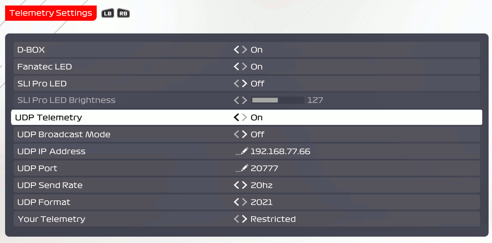

# F1 2021 Telemetry Parser 🏎


#### Python UDP Client & Telemetry Parser for the F12021 game by Codemasters.

The UDP Specification (Packet Decoding) by Codemasters used for this project can be found [here.](https://forums.codemasters.com/topic/80231-f1-2021-udp-specification/?do=findComment&comment=624274)

&nbsp;

## Overview

The F1 series of games support the outputting of key game data via UDP, allowing developers to receive, decode and make use of this data for many different applications (Dashboards, HUD Displays, Performance Analysis etc.)

This project was designed with the intention of becoming a solid 'base' project that will allow anyone to easily stem from or build on, which is why I chose to use Python. 

For optimisation purposes, I hope to develop a C/C++ version of this project at some point in the future.

&nbsp;


## Setup

### Enable UDP Telemetry on F12021:

&nbsp;

- **Game Options --> Settings --> Telemetry Settings**

&nbsp;



### Telemetry Settings

- **UDP Telemetry** must be set to **On**
- **UDP Broadcast Mode** can be set to **Off** (as it is very resource intensive)
- **UDP IP Address** must be set to the **Device IP Address** of the device you wish to receive the data on
- **UDP Port** can remain as the default value: **20777**
- **UDP Send Rate** can remain at **20hz**
- **UDP Format** must remain at **2021**

&nbsp;

## Usage

While inside the **client** directory, run the following command:

```python
python3 monitor.py
```

The packet information received is then decoded and written to it's associated json file (categorised by packet type). **Note:** This information should ideally be stored in a time-series database like InfluxDB, Prometheus etc.

If you wish to optimise the telemetry parser, or ignore all packet information that you do not deem useful, you can filter the UDP data stream to only process certain packets by specifying them like this:

```python
python3 monitor.py PacketCarTelemetryData PacketLapData
```

In this example, we are filtering for the car telemetry data, as well as the lap data.


